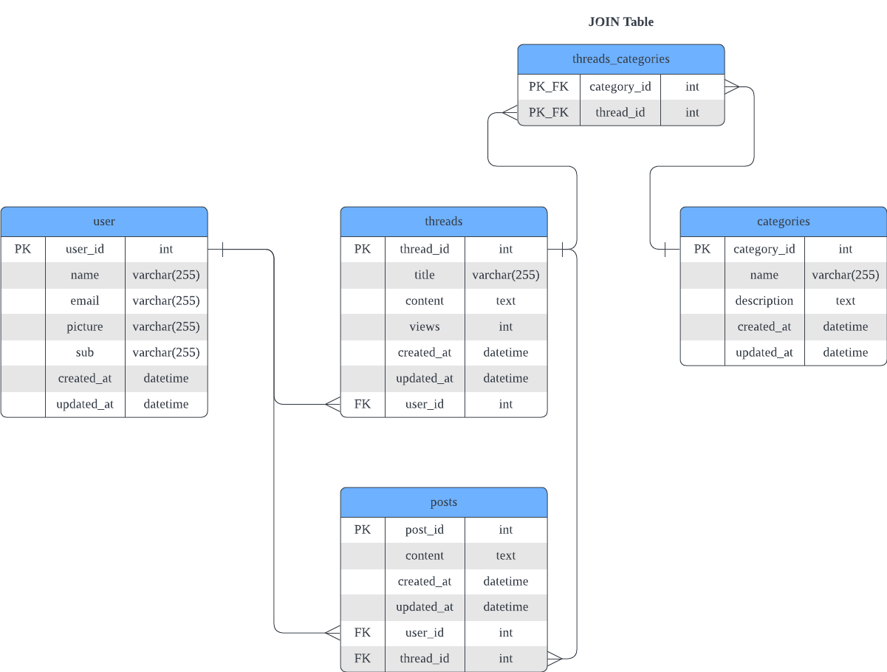

# CVWO Assignment

<!-- ## Online Demo -->
<!---->
<!-- Deployed site:  -->

## Architecture

<div align="center">

| Name | Description | Technologies |
| - | - | - |
| Frontend | UI/UX | Typescript + React |
| Application | RESTful API | Golang (Go-Chi) |
| Database | Persistent Storage Layer | PostgreSQL + Docker |
| Hosting | Deployment, Web Server, Storage | Heroku, Netlify, Render, AWS(?) |

</div>

## Project Requirements

### Authentication

Authentication allows the forum to control who has access to its features and content. It provides a personalised and secure experience for users.

1. **As a** user, **I want** to be able to create an account on the forum **so that** I can particiate in discussions(threads) and engage with other users.
    - The user can create an account by providing a *unique* username or email, and password.
    - The user can authenticate through Google or Facebook.

1. **As a** user, **I want** to be able to log in and log out of my account **so that** I can access my personal settings and preferences.
    - The user can log in to their account by entering their username and password, or authenticate via Google or Facebook.
    - The user can log out of their account by clicking a "sign out" button.

### User Navigation and Thread Organisation

Good navigation and organisation make the forum easy to use and accessible to users. 

1. **As a** user, **I want** to be able to view a list of all *recent* threads **so that** I can have a general overview of the forum's content.
    - The user can view a list of recent threads organised by time (most recent update).

1. **As a** user, **I want** to be able to view a list of all the available threads **so that** I can *easily* find discussions that interest me.
    - The user can view a list of all threads topics organised by *category*.

1. **As a** user, **I want** to be able to search for specific discussions or keywords **so that** I can easily find relevant information on the forum.
    - The user can search for specific discussions or keywords by typing their search query into a search bar and clicking a "search" button.

### CRUD for Threads and Posts

The bread and butter of the forum. Only by allowing users to create, view, update, and delete threads and posts(replies) will the forum allow for users to particpate in discussion.

1. **As a** user, **I want** to be able to create a new thread **so that** I can share my thoughts and ideas with other members.
    - The user can create a new thread by providing a title, category, and description.

1. **As a** user, **I want** to be able to view the details of a specific thread **so that** I can see comments and replies.
    - The user can view a thread by clicking on a thread.

1. **As a** user, **I want** to be able to edit or delete my comments **so that** I can correct any mistakes.
    - The user can edit or delete their comments by clicking an "edit" or "delete" button.

1. **As a** user, **I want** to be able to reply to other people's posts **so that** I can engage in discussions and contribute to the conversation.

    - The user can reply to other people's posts by typing their response and clicking a "submit" button.

### Social Features

Social features allow users to interact with each other on the forum. These features help to foster a sense of community, and encourage engagement and participation.

1. **As a** user, **I want** to be able to upvote or downvote other users' comments **so that** I can show my approval or support for another user's comment.
    - The user can upvote or downvote other people's posts by clicking the respective button next to the comment.

1. **As a** user, **I want** to be able to customize my profile **so that** I can personalize my experience on the forum.
    - The user can customize their profile by clicking on a "setting" button, which allows them to change their profile picture, bio, and other personal information.
 
1. **As a** user, **I want** to be able to view other users' profiles **so that** I can learn more about them and see their past contributions to the forum.
    - The user can view other users' profiles by clicking on their username, which displays their profile information, and past posts and comments.

### Moderation Features

Monitoring and managing content ensures that the forum is a safe place for users.

1. **As a** moderator, **I want** to be able to delete or edit posts that violate the forum's rules or guidelines **so that** we can maintain a positive and respectful community.
    - The moderator can delete or edit posts by clicking a "delete" or "edit" button next to the post.

## API Endpoints

Refer to [API Documentation](https://github.com/minreiseah/cvwo-assignment/tree/main/api/API.md)

## Execution Plan

#### Dec 9 - 11

- [x] Learn Typescript.
- [x] Read up on test driven development in React.
- [x] Design basic wireframes in Figma.
- [x] Read up on MVC.

#### Dec 12 - 18

- [x] Implement basic frontend in React.
- [x] Learn about [TDD in Go](https://quii.gitbook.io/learn-go-with-tests/).
- [x] Read up on [Go-Chi](https://go-chi.io/#/README) to build REST API.
- [x] Implement database in PostgreSQL.
    - Note: Using a postgres:alpine-15 docker image
- [x] API endpoints scaffolded in Go.

#### Dec 19 - 30

- No Work. On Break.

#### Jan 1 - 7

- [ ] Complete API Endpoints.
- [ ] Connect postgres server to Go.
- [ ] Dockerise

#### Jan 8 - 14

- [ ] Hosting.
- [ ] Buffer.

#### Jan 15 - 25

- [ ] Stocktake, stretch goals.

## Notes

Generally,

Framework/language-specific notes are shown below.

#### Documentation

- React: `react-docgen` for JSDocs
- Go: `godoc` for docstring
- API: Github pages (tentative)

#### React

- This project will use npm instead of yarn as I am more familiar with the former.
- Chakra UI is chosen over MUI for its flexibility and ease of modification.
- I will attempt to integrate Redux from the start rather than refactoring my code to integrate it later on.

#### Go

```
.
├── api // API information & documentation
├── build // build files
├── cmd // contains main.go
├── internal 
│   ├── database // database information
│   ├── domain // each domain represents an API subrouter
│   │   ├── categories
│   │   │   ├── handler.go // endpoint logic
│   │   │   ├── model.go // type information
│   │   │   └── routes.go // subrouter routes
│   │   ├── posts
│   │   ├── threads
│   │   ├── threadsCategories
│   │   └── users
│   ├── router
│   └── server
│       ├── routes.go // all main routes
│       └── server.go // server information
```


#### Database



- As most hosting providers seem to provide native PostgreSQL support, I will tentatively pick PostgreSQL for my database.
- Seems like `pg_dump` can be used to create PostgreSQL backups

#### Hosting

- Requirements include: frontend, database, application/web server for Rest API.
- Render for free-tier hosting. 
- Netlify only provides a serverless backend.

### Stretch Goals

- Implementing Cron to backup the database.
- Docker
- AWS


