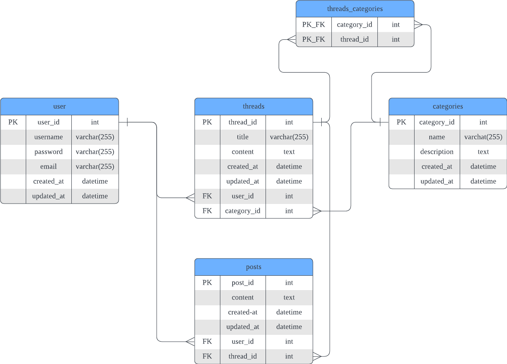

# API Endpoints

## Overview

The database schema includes the following entities:

- **Users**: Represents the users of the forum, with attributes such as username, email, and password.

- **Categories**: Represents the categories in the forum, with attributes such as title and description.

- **Threads**: Represents the threads in the forum, with attributes such as title, content, and user_id.

- **Posts**: Represents the posts or replies in the forum, with attributes such as content, thread_id, and user_id.

The entities are **related** as follows:

- Each thread can have *multiple* categories, and *each* category can have *multiple* threads.
- Each post belongs to a *single* thread, and *each* thread can have *multiple* posts.
- Each user can create *multiple* threads and posts.

Based on this schema, we have defined the following API endpoints:

## Endpoints

### Users

Retrieve and create users.

#### `GET /users`

- Description: Retrieves a list of *all* users.
- Request data format: None
- Response data format: JSON
- Authentication: None

#### `GET /users/:user_id`
* Description: Retrives the profile of a user.
* Request data format: None
* Response data format: JSON
* Authentication: None

#### `POST /users/new`

- Description: Creates a new user.
- Request data format: JSON
- Response data format: JSON
- Authentication: None

### Categories

Retrieve all categories. Note that users are not allowed to create categories. Only administrators are able to create and manage categories in the database.

#### `GET /categories`

- Description: Retrieves a list of *all* categories.
- Request data format: None
- Response data format: JSON

### Threads

Retrieves thread by thread_id
Retrieve info of all threads or threads from a specific category.
Create threads in a specific category.
Edit or delete threads.

#### `GET /threads/:thread_id`

- Description: Retrieves thread by thread_id.
- Request data format: None
- Response data format: JSON
- Authentication: None

#### `GET /threads`

- Description: Retrieves a list of *all* threads.
- Request data format: None
- Response data format: JSON
- Authentication: None

#### `GET /threads?sort=:sort_param`
- Description: Retrieves a list of all threads sorted by time or popularity, e.g. date_asc, popularity_desc
- Request data format: JSON
- Response data format: JSON
- Authentication: None

#### `POST /threads/new`

- Description: Creates a *new* thread in a *specified* category.
- Request data format: JSON
- Response data format: JSON
- Authentication: Required

#### `GET /categories/:category_id/threads`

- Description: Retrieves a list of *all* threads from a *specified* category.
- Request data format: None
- Response data format: JSON
- Authentication: None

#### `PUT /threads/:thread_id/edit`

- Description: Edits a thread.
- Request data format: JSON
- Response data format: JSON
- Authentication: Required

#### `DELETE /threads/:thread_id/delete`

- Description: Deletes a thread.
- Request data format: None
- Response data format: JSON
- Authentication: Required

### Threads_Categories

#### `POST /threads_categories`

- Description: Creates a composite link between thread_id and category_id
- Request data format: JSON
- Response data format: JSON
- Authentication: Required

### Posts

Retrieve all posts or posts from a specific thread.
Create posts (replies) in a specific thread.
Edit or delete posts.

#### `GET /posts`

- Description: Retrieves a list of *all* posts.
- Request data format: None
- Response data format: JSON
- Authentication: None

#### `POST /threads/:thread_id/posts/new`

- Description: Creates a *new* post in a specific thread. 
- Request data format: JSON
- Response data format: JSON
- Authentication: Required

#### `GET /threads/:thread_id/posts`

- Description: Retrieves a list of *all* posts from a *specified* thread.
- Request data format: None
- Response data format: JSON
- Authentication: None

#### `PUT /threads/:thread_id/posts/:post_id/edit`

- Description: Edits a post from a *specified* thread.
- Request data format: JSON
- Response data format: JSON
- Authentication: Required

#### `DELETE /threads/:thread_id/posts/:post_id/delete`

- Description: Deletes a post from a *specified* thread.
- Request data format: None
- Response data format: JSON
- Authentication: Required
